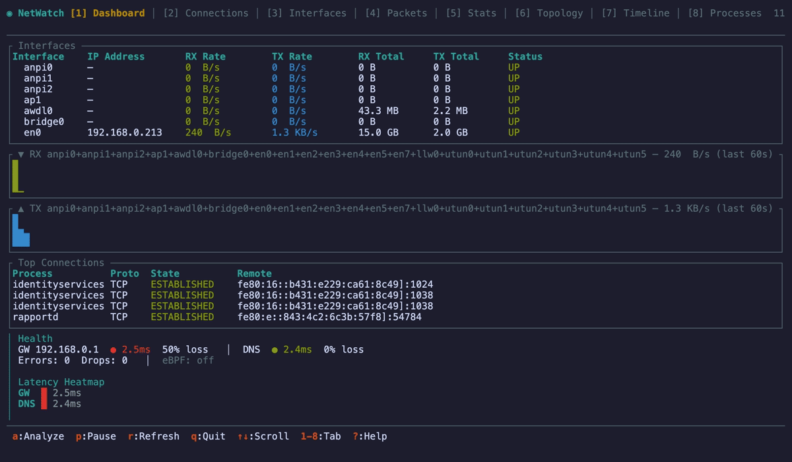
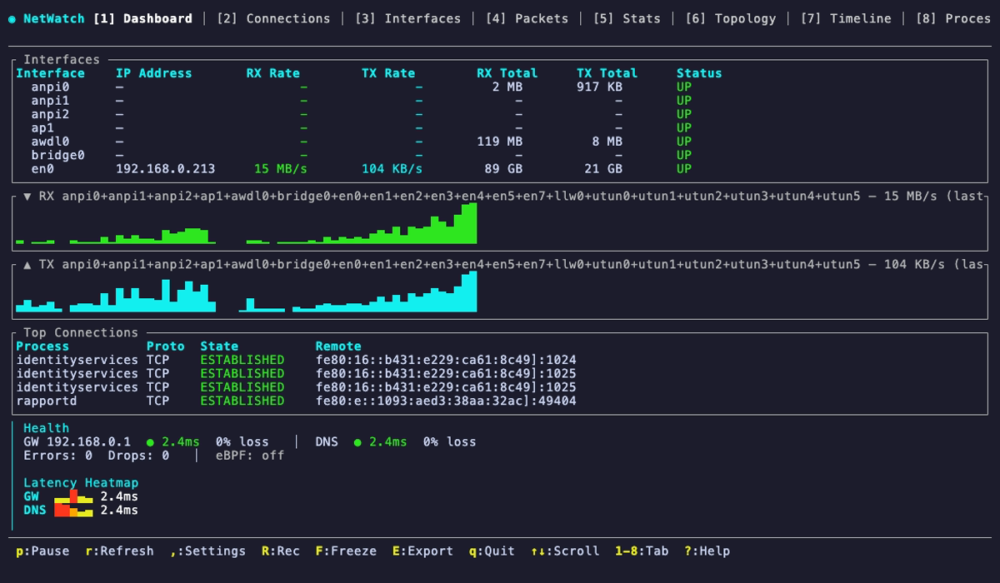
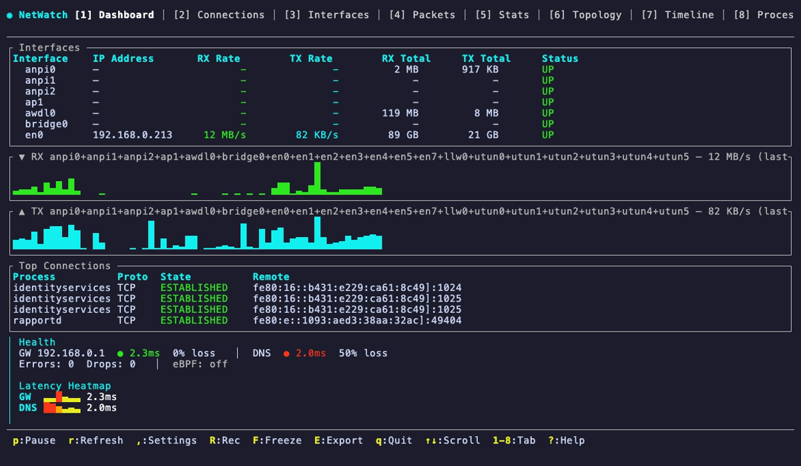
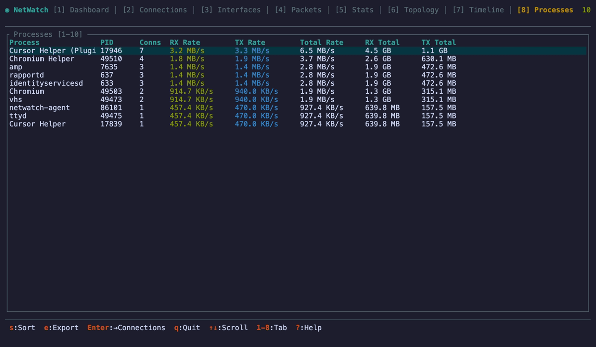

<p align="center">
  <h1 align="center">NetWatch</h1>
  <p align="center">
    <strong>Real-time network diagnostics in your terminal. One command, zero config, instant visibility.</strong>
  </p>
  <p align="center">
    <a href="https://crates.io/crates/netwatch-tui"></a>
    <a href="https://github.com/matthart1983/netwatch/releases"></a>
    
    
    <a href="https://github.com/matthart1983/netwatch/wiki"></a>
  </p>
</p>

<p align="center">
  
</p>

<p align="center">
  <em>Launch → see every interface, connection, and health probe instantly. Arm the flight recorder before an incident disappears.</em>
</p>

---

## Install

```bash
# Homebrew (macOS / Linux)
brew install matthart1983/tap/netwatch

# Cargo
cargo install netwatch-tui

# Pre-built binaries — see Releases
```

<details>
<summary><strong>All platforms & options</strong></summary>

| Platform | Download |
|----------|----------|
| Linux (x86_64) | [`netwatch-linux-x86_64.tar.gz`](https://github.com/matthart1983/netwatch/releases/latest) |
| Linux (aarch64) | [`netwatch-linux-aarch64.tar.gz`](https://github.com/matthart1983/netwatch/releases/latest) |
| macOS (Intel) | [`netwatch-macos-x86_64.tar.gz`](https://github.com/matthart1983/netwatch/releases/latest) |
| macOS (Apple Silicon) | [`netwatch-macos-aarch64.tar.gz`](https://github.com/matthart1983/netwatch/releases/latest) |

**From source:**

```bash
git clone https://github.com/matthart1983/netwatch.git && cd netwatch
cargo build --release
```

**Prerequisites:** Rust 1.70+, libpcap (`sudo apt install libpcap-dev` on Linux, included on macOS)

</details>

## Quick Start

```bash
netwatch            # Interface stats, connections, config
sudo netwatch       # Full mode — adds health probes + packet capture
netwatch --generate-config
```

### Flight Recorder

Catch transient failures that vanish before you can inspect them:

```text
Shift+R   Arm a rolling 5-minute recorder
Shift+F   Freeze the current incident window
Shift+E   Export an incident bundle to ~/netwatch_incident_YYYYMMDD_HHMMSS/
```

Each bundle includes `summary.md`, `connections.json`, `health.json`, `bandwidth.json`, `dns.json`, `alerts.json`, `manifest.json`, and `packets.pcap` when capture data is available.

---

## Why NetWatch?

Most network tools make you choose: **see what's happening** (iftop, bandwhich) or **inspect packets** (Wireshark, tshark). NetWatch does both in a single terminal — from a 10,000-foot dashboard view down to individual packet bytes.

| What you get | How fast |
|---|---|
| Every interface with live RX/TX sparklines | **Instant** |
| Every connection with process name + PID | **Instant** |
| Gateway & DNS health with latency heatmap | **Instant** |
| Wireshark-style packet capture + decode | One keypress |
| Rolling incident capture + frozen export bundle | One keypress |
| Network topology map with traceroute | One keypress |
| PCAP export for offline analysis | One keypress |

**No config files. No setup. No flags required.**

---

## Screenshots

<table>
  <tr>
    <td align="center"><strong>Dashboard</strong><br>Interfaces, bandwidth, health, top connections<br></td>
    <td align="center"><strong>Connections</strong><br>Every socket with process name, PID, GeoIP<br></td>
  </tr>
  <tr>
    <td align="center"><strong>Interfaces</strong><br>Per-interface detail with sparkline history<br></td>
    <td align="center"><strong>Topology</strong><br>Network map with health indicators + traceroute<br></td>
  </tr>
</table>

---

## Features

### 🖥️ Dashboard
Everything at a glance — interfaces, aggregate bandwidth graph, top connections, gateway/DNS health probes, and a color-coded latency heatmap. Useful in 5 seconds.

### 🔌 Connections
Every open socket with **process name**, PID, protocol, state, remote address, GeoIP location, and per-connection **latency sparklines**. Sort by any column, jump to filtered packet view.

### 📡 Interfaces
Per-interface detail: IPv4/IPv6 addresses, MAC, MTU, total RX/TX with individual sparkline history, errors, and drops.

### 📦 Packet Capture
Live capture with deep protocol decoding — **DNS** (queries, types, response codes), **TLS** (version, SNI), **HTTP** (method, path, status), **ICMP**, **ARP**, **DHCP**, **NTP**, **mDNS**, and 25+ service labels. TCP stream reassembly, handshake timing, display filters, BPF capture filters, bookmarks, and PCAP export.

### 📈 Processes
Per-process bandwidth ranking with live RX/TX rates, totals, and connection counts. Useful for spotting the process behind a noisy host or bandwidth spike.

### 🎥 Flight Recorder
Arm a rolling 5-minute capture window, then freeze it manually or when a critical network-intel alert fires. Export a self-contained incident bundle with a human-readable summary, `.pcap`, connection/process context, health samples, DNS analytics, and alert history.

### 🗺️ Topology
ASCII network map showing your machine, gateway, DNS servers, and top remote hosts with connection counts and color-coded health indicators. Built-in **traceroute** from any host.

### 📊 Stats
Protocol hierarchy table with packet counts, byte totals, and distribution bars. TCP handshake histogram with min/avg/median/p95/max.

### ⏱️ Timeline
Gantt-style connection timeline — when each connection was active, color-coded by TCP state. Adjustable windows from 1 minute to 1 hour.

### ⚙️ Settings
Built-in settings overlay for theme, default tab, refresh rate, capture interface, packet-follow mode, GeoIP paths, BPF filter, and alert thresholds. Use `,` to open it and `S` to persist changes.

---

## Display Filters

Wireshark-style filter syntax in the Packets tab:

```
tcp                        # Protocol
192.168.1.42               # IP address (src or dst)
ip.src == 10.0.0.1         # Directional
port 443                   # Port
stream 7                   # Stream index
contains "hello"           # Text search
tcp and port 443           # Combinators
!dns                       # Negation
google                     # Bare word → contains "google"
```

---

## Keyboard Controls

| Key | Action |
|-----|--------|
| `1`–`8` | Switch tabs |
| `↑` `↓` | Navigate |
| `p` | Pause / resume |
| `r` | Force refresh |
| `R` | Arm / reset flight recorder |
| `F` | Freeze current incident window |
| `E` | Export incident bundle |
| `/` | Filter (Packets) |
| `c` | Start/stop capture (Packets) |
| `s` | Sort / stream view |
| `w` | Export to .pcap |
| `T` | Traceroute |
| `W` | Whois lookup |
| `t` | Cycle theme |
| `,` | Settings |
| `?` | Help |
| `q` | Quit |

<details>
<summary><strong>Full keybinding reference</strong></summary>

### Connections
| Key | Action |
|-----|--------|
| `s` | Cycle sort column |
| `Enter` | Jump to Packets with connection filter |
| `T` | Traceroute to remote IP |
| `W` | Whois lookup |
| `e` | Export connections to JSON + CSV |
| `g` | Toggle GeoIP column |

### Packets
| Key | Action |
|-----|--------|
| `c` | Start/stop capture |
| `R` | Arm / disarm flight recorder |
| `F` | Freeze incident window |
| `E` | Export incident bundle |
| `i` | Cycle capture interface |
| `b` | Set BPF capture filter |
| `/` | Display filter |
| `s` | Stream view |
| `w` | Export .pcap |
| `x` | Clear packets |
| `m` | Bookmark packet |
| `n`/`N` | Next/prev bookmark |
| `f` | Auto-follow |
| `W` | Whois lookup for selected packet IPs |

### Stream View
| Key | Action |
|-----|--------|
| `→` `←` | Filter A→B / B→A |
| `a` | Both directions |
| `h` | Toggle hex/text |
| `Esc` | Close |

### Topology
| Key | Action |
|-----|--------|
| `T` | Traceroute to selected host |
| `Enter` | Jump to Connections for host |
| `Esc` | Close traceroute overlay |

### Timeline
| Key | Action |
|-----|--------|
| `t` | Cycle time window (1m–1h) |
| `Enter` | Jump to Connections |

### Processes
| Key | Action |
|-----|--------|
| `↑` `↓` | Navigate |
| `e` | Export connections to JSON + CSV |

### Settings
| Key | Action |
|-----|--------|
| `↑` `↓` | Navigate settings |
| `Enter` | Edit selected setting |
| `←` `→` | Cycle theme |
| `S` | Save config |
| `Esc` | Close |

</details>

---

## Incident Bundle

When the Flight Recorder is armed, NetWatch keeps a bounded rolling window of evidence. On freeze or export, it writes:

```text
netwatch_incident_20260403_103501/
  summary.md
  manifest.json
  connections.json
  health.json
  bandwidth.json
  dns.json
  alerts.json
  packets.pcap   # present when packets were captured
```

This makes bug reports, incident reviews, and demos much easier: you keep the packet evidence and the operational context that explains it.

---

## Permissions

| Feature | `netwatch` | `sudo netwatch` |
|---------|:---:|:---:|
| Interface stats & rates | ✅ | ✅ |
| Active connections | ✅ | ✅ |
| Network configuration | ✅ | ✅ |
| Health probes (ICMP) | ❌ | ✅ |
| Packet capture | ❌ | ✅ |

Degrades gracefully — features that need root show a clear message, never crash.

---

## Themes

5 built-in themes with instant switching via `t`:

**Dark** (default) · **Light** · **Solarized** · **Dracula** · **Nord**

Theme changes apply immediately. Persist them from the Settings overlay with `S`.

---

## Configuration

NetWatch runs well with zero setup, but you can persist preferences for theme, default tab, refresh rate, capture interface, GeoIP database paths, packet-follow behavior, BPF filter, and alert thresholds.

```bash
netwatch --generate-config
```

That writes a starter config file to your platform config directory. You can also edit settings live in the app with `,` and save with `S`.

---

## How It Works

| Collector | Interval | macOS | Linux |
|-----------|:--------:|-------|-------|
| Interface stats | 1s | `netstat -ib` | `/sys/class/net/*/statistics` |
| Connections | 2s | `lsof -i -n -P` | `/proc/net/tcp` + `/proc/*/fd` |
| Health probes | 5s | `ping` | `ping` |
| Packets | Real-time | libpcap (BPF) | libpcap |
| GeoIP | On-demand | MaxMind .mmdb / ip-api.com | MaxMind .mmdb / ip-api.com |

```
Raw bytes → Ethernet → IPv4/IPv6/ARP → TCP/UDP/ICMP → DNS/TLS/HTTP/DHCP/NTP
                                             ↓
                               Stream tracking · Handshake timing
                               Expert info · Payload extraction
```

---

## Related

**[ESSH](https://github.com/matthart1983/essh)** — If you manage the hosts you monitor, ESSH is built for the same workflow. Same TUI aesthetic, pure-Rust SSH client with concurrent sessions, live remote host diagnostics (CPU, memory, disk, processes — no agent install), fleet management, file transfer, and port forwarding. Connects where NetWatch observes.

**[NetWatch Cloud](https://www.netwatchlabs.com)** — Hosted fleet monitoring for the servers you run NetWatch against. Tiny Rust agent on each Linux host, real-time dashboard, email + Slack alerts on latency, packet loss, or hosts going offline. **Free while we grow.**

---

## Contributing

Contributions welcome! See [CONTRIBUTING.md](CONTRIBUTING.md) for coding conventions and [WIKI.md](WIKI.md) for a current architecture guide.

## License

MIT
