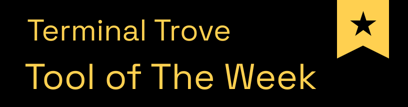
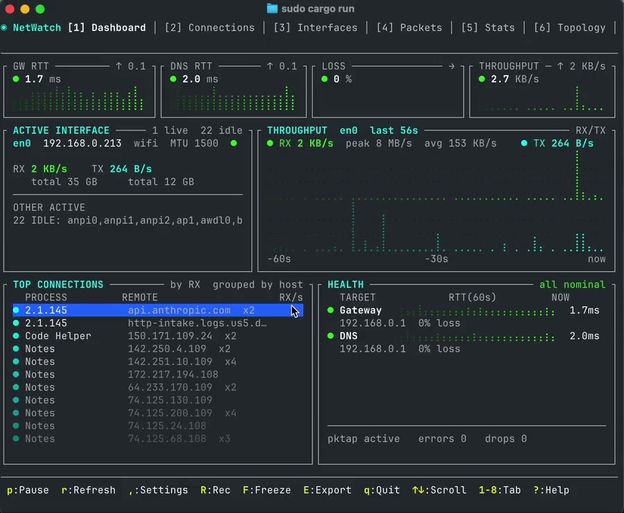

<p align="center">
  <h1 align="center">NetWatch</h1>
  <p align="center">
    <strong>See what your network is actually doing — live, in your terminal.</strong><br>
    <em>A network monitor that reads encrypted traffic, names the process behind every connection, and catches malware calling home. One binary. Zero config.</em>
  </p>
  <p align="center">
    <a href="https://crates.io/crates/netwatch-tui"></a>
    <a href="https://crates.io/crates/netwatch-tui"></a>
    <a href="https://github.com/matthart1983/netwatch/releases"></a>
    
    
  </p>
  <p align="center">
    <a title="Tool of The Week on Terminal Trove" href="https://terminaltrove.com/netwatch/"></a>
  </p>
</p>

<p align="center">
  
</p>

<p align="center">
  <em>Reading the plaintext out of a live <strong>TLS 1.3</strong> session — decrypted right in the terminal. No proxy, no man-in-the-middle.</em>
</p>

---

Most network tools answer one question — *"what's using my bandwidth?"* — and stop. NetWatch keeps going. It decodes the protocols on the wire, tells you **which program** opened each connection, and watches for the patterns that mean trouble — a port scan, malware beaconing to a command server, data sneaking out over DNS. When something looks wrong, one keypress freezes a portable evidence bundle you can attach to a bug report.

Think of it as **one zero-config binary that does the job of a bandwidth meter, the triage view of Wireshark, and a lightweight intrusion detector** — without leaving the terminal.

**Made for** blue-teamers, incident responders, SREs, and homelabbers who need to see what's happening *right now* — not parse a capture file an hour later.

<samp>500+ tests · Landlock-sandboxed · safely parses hostile traffic</samp>

<p align="center">
  <a href="demo-tour.mp4">
    
  </a>
</p>

<p align="center">
  <em>▶ A quick tour of the live TUI — dashboard, deep packet inspection, network topology with traceroute, and automatic alerting. <a href="demo-tour.mp4">Click to play.</a></em>
</p>

## Why NetWatch

- 🔓 **Read encrypted traffic you control** — point a browser or app's `SSLKEYLOGFILE` at NetWatch and watch the plaintext of its TLS 1.3 sessions decode live, the same way Wireshark does it. No proxy, no certificates, nothing in the middle.
- 🧬 **Fingerprint the software behind a connection** — JA4 turns each TLS/QUIC handshake into a stable fingerprint, so you can recognize a specific client — or a specific piece of malware — *even though the traffic is encrypted*, the way you'd recognize a browser by its user-agent. Pivot on a fingerprint to find every other flow from the same software.
- 🚨 **Catch malware calling home** — built-in detection for C2 beaconing (regular, low-jitter check-ins), port scans, and DNS tunneling runs in the background with zero setup. A critical alert auto-freezes the recorder so the evidence is already saved when you look.
- ⚙️ **Name the process behind every connection** — a kernel-level eBPF probe attributes each socket to the program that opened it, not a best-guess from polling. Falls back gracefully where eBPF isn't available.
- 📡 **Decode the protocols, not just the ports** — real L7 parsing of TLS, QUIC, HTTP, DNS, SSH, and a dozen more, with TCP stream reassembly and handshake timing — so you see `api.github.com` and the JA4 fingerprint, not just "port 443."
- 🎥 **Freeze the evidence** — arm a rolling recorder and freeze any incident into a portable bundle: the packets *plus* the connections, DNS, health, and alerts that explain them. Built for bug reports and post-mortems.
- 🛡️ **Safe by design** — after setup, NetWatch drops its privileges and locks itself into a Landlock filesystem allow-list (Linux). A tool that parses hostile traffic *cannot* read your SSH keys, browser profiles, or `/etc/shadow`.

**No config files. No setup. No flags required.**

## Install

```bash
# Homebrew (macOS / Linux)
brew install matthart1983/tap/netwatch

# Cargo
cargo install netwatch-tui

# Or grab a pre-built binary from Releases
```

<details>
<summary><strong>All platforms &amp; build-from-source</strong></summary>

| Platform | Download |
|----------|----------|
| Linux (x86_64, Debian/Ubuntu) | [`netwatch-linux-x86_64.tar.gz`](https://github.com/matthart1983/netwatch/releases/latest) |
| Linux (aarch64, Debian/Ubuntu) | [`netwatch-linux-aarch64.tar.gz`](https://github.com/matthart1983/netwatch/releases/latest) |
| Linux (x86_64, static — Arch/Fedora/Alpine/any distro) | [`netwatch-linux-x86_64-static.tar.gz`](https://github.com/matthart1983/netwatch/releases/latest) |
| Linux (aarch64, static — Arch/Fedora/Alpine/any distro) | [`netwatch-linux-aarch64-static.tar.gz`](https://github.com/matthart1983/netwatch/releases/latest) |
| macOS (Intel) | [`netwatch-macos-x86_64.tar.gz`](https://github.com/matthart1983/netwatch/releases/latest) |
| macOS (Apple Silicon) | [`netwatch-macos-aarch64.tar.gz`](https://github.com/matthart1983/netwatch/releases/latest) |

The `-static` Linux builds bundle libpcap and have no runtime dependencies — use these on Arch, Fedora, Alpine, or any distro where the default builds report `libpcap.so.0.8: cannot open shared object file`.

**From source:**

```bash
git clone https://github.com/matthart1983/netwatch.git && cd netwatch
cargo build --release
```

**Prerequisites:** Rust 1.70+, libpcap (`sudo apt install libpcap-dev` on Linux, included on macOS).

</details>

## Quick start

```bash
netwatch            # interface stats, connections, config — no privileges needed
sudo netwatch       # full mode — adds live packet capture + health probes
```

That's it. Switch tabs with `1`–`9`, press `?` for help, `q` to quit. The Dashboard is useful in five seconds; everything below is there when you need to go deeper.

> **Linux without `sudo`:** grant the capture capabilities once and run as your normal user —
> `sudo setcap 'cap_net_raw,cap_bpf,cap_perfmon+eip' "$(which netwatch)"`. Re-run it after every upgrade ([details](docs/REFERENCE.md#running-without-sudo-linux)).

### See it decrypt TLS in 60 seconds

The fastest way to understand what NetWatch is — watch it read the plaintext of a TLS 1.3 session *you* control:

```bash
sudo netwatch                                              # 1. launch, then open the Packets tab (4)
SSLKEYLOGFILE=/tmp/sslkeylog.txt curl https://example.com  # 2. any client that exports its keys
#                                                            3. filter the Packets tab with:  decrypted:true
```

The decrypted application data renders inline. A keylog miss never breaks capture — that record just stays opaque. (`SSLKEYLOGFILE` is the same mechanism Wireshark uses; it only works for traffic *you* control, never third-party or malware traffic.)

## What you get

Nine tabs, switched with `1`–`9`:

| # | Tab | What it shows |
|---|-----|---------------|
| 1 | **Dashboard** | Interfaces, bandwidth graph, top connections, gateway/DNS health, latency heatmap. Useful in 5 seconds. |
| 2 | **Connections** | Every socket with its process + PID, protocol, state, GeoIP, and latency sparklines. |
| 3 | **Interfaces** | Per-interface IPv4/IPv6, MAC, MTU, RX/TX, errors, drops. |
| 4 | **Packets** | Live capture with real L7 decode, TLS 1.3 decryption, JA4, stream reassembly, filters, PCAP export. |
| 5 | **Stats** | Protocol breakdown by bytes + TCP handshake-timing histogram. |
| 6 | **Topology** | ASCII map of machine → gateway → DNS → top hosts, with traceroute. |
| 7 | **Timeline** | Connection timeline color-coded by TCP state; security alerts land here. |
| 8 | **Processes** | Per-process bandwidth ranking with live RX/TX and connection counts. |
| 9 | **Insights** | *(opt-in)* feeds a snapshot to a local/cloud LLM for plain-language analysis. |

The Packets tab is where the forensics live — deep protocol decoding, live TLS 1.3 decryption, JA4 threat-hunting, Wireshark-style display filters, and incident capture. **[See the full feature reference →](docs/REFERENCE.md)**

## Deeper dives

| Guide | What's in it |
|-------|--------------|
| **[Feature reference](docs/REFERENCE.md)** | Every keybinding, the display-filter language, protocol decoder list, themes, and config options. |
| **[TLS 1.3 decryption](docs/REFERENCE.md#tls-13-decryption)** | How `SSLKEYLOGFILE` decryption works, supported cipher suites, and what it can and can't read. |
| **[Threat hunting with JA4](docs/REFERENCE.md#threat-hunting-with-ja4)** | Fingerprinting clients and pivoting across flows. |
| **[Security &amp; the Landlock sandbox](docs/REFERENCE.md#security--forensics)** | The threat model, capability dropping, and the filesystem allow-list. |
| **[Flight Recorder](docs/REFERENCE.md#flight-recorder)** | Arming, freezing, and the contents of an incident bundle. |
| **[AI Insights](INSIGHTS.md)** | Optional local/cloud LLM analysis (off by default). |

## How it works

```
Raw bytes → Ethernet → IPv4/IPv6/ARP → TCP/UDP/ICMP → L7 decoders
                                            ↓
                          Stream reassembly · Handshake timing
                          TLS 1.3 decryption · JA4 · Threat detection
```

| Collector | macOS | Linux |
|-----------|-------|-------|
| Connections | `lsof` + PKTAP | `/proc/net/tcp` + eBPF kprobe |
| Packets | libpcap (BPF) | libpcap |
| Process attribution | PKTAP | eBPF kprobe, with `lsof`/`ss` fallback |

Everything degrades gracefully: features that need elevated privileges show a clear message and fall back, never crash. Full architecture notes live in [WIKI.md](WIKI.md).

## Related

**Siblings:** [SysWatch](https://github.com/matthart1983/syswatch) (system) and [DiskWatch](https://github.com/matthart1983/diskwatch) (disk) — same chrome, different surface. **[ESSH](https://github.com/matthart1983/essh)** — a pure-Rust SSH client with the same TUI aesthetic; connects where NetWatch observes.

**[NetWatch Cloud](https://www.netwatchlabs.com)** — hosted fleet monitoring for the servers you run NetWatch against. A tiny Rust agent on each Linux host, a real-time dashboard, and email + Slack alerts on latency, packet loss, or hosts going offline. **Free while we grow.** The [agent](https://github.com/matthart1983/netwatch-agent), [SDK](https://github.com/matthart1983/netwatch-sdk), and [dashboard](https://github.com/matthart1983/netwatch-dashboard) are MIT; the hosted backend is proprietary.

## Contributing

Questions, ideas, and bug reports are welcome in [GitHub Discussions](https://github.com/matthart1983/netwatch/discussions) and [Issues](https://github.com/matthart1983/netwatch/issues). See [CONTRIBUTING.md](CONTRIBUTING.md) for coding conventions and [WIKI.md](WIKI.md) for the architecture guide.

## License

MIT
